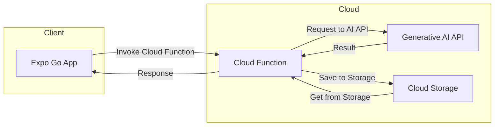
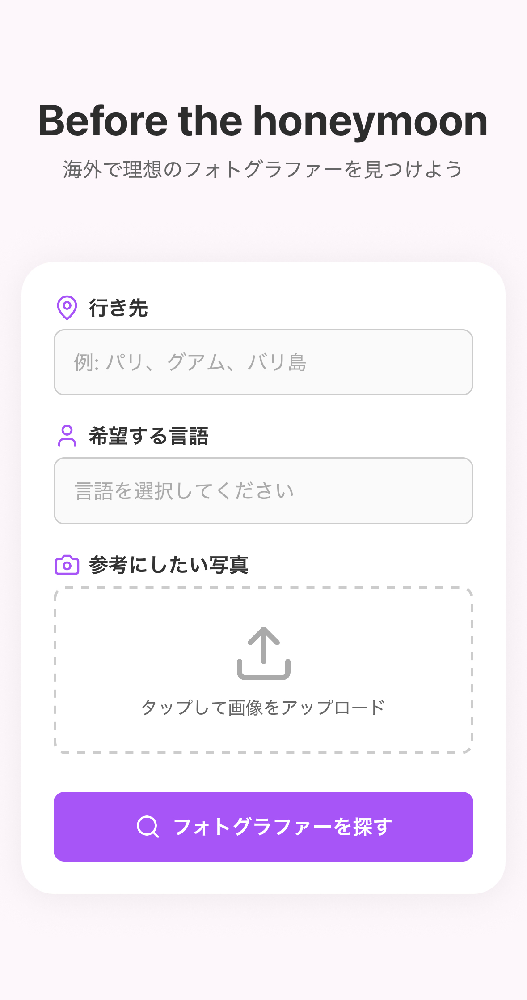

# BeforeTheHoneymoon

## 概要

BeforeTheHoney は、フォトグラファーのためのポートフォリオサイトです。

## ディレクトリ構成

- frontend: Expo Go
- infra Pulumi
- backend: TODO: 吉田さん作成予定

## 全体アーキテクチャ

```mermaid
# BeforeTheHoneymoon

## 概要

BeforeTheHoney は、フォトグラファーのためのポートフォリオサイトです。

## ディレクトリ構成

- frontend: Expo Go
- infra Pulumi
- backend: TODO: 吉田さん作成予定

## 全体アーキテクチャ

```mermaid
flowchart TD
    A[Frontend<br/>Expo Go] --> B[Cloud Function<br/>API Gateway]
    B --> C[Generative AI API<br/>画像処理・解析]
    C --> D[Cloud Storage<br/>画像・メタデータ保存]
    D --> E[Frontend<br/>結果表示]
    
    style A fill:#e1f5fe
    style B fill:#f3e5f5
    style C fill:#e8f5e8
    style D fill:#fff3e0
    style E fill:#e1f5fe
```
```

このフローチャートでは：
- 各コンポーネントの役割を明確化
- 視覚的に分かりやすい縦方向の流れ
- 色分けでコンポーネントを区別
- 技術スタックの詳細を追加

より詳細な双方向のフローが必要でしたら、以下のようなバージョンも可能です：



## イメージ図


