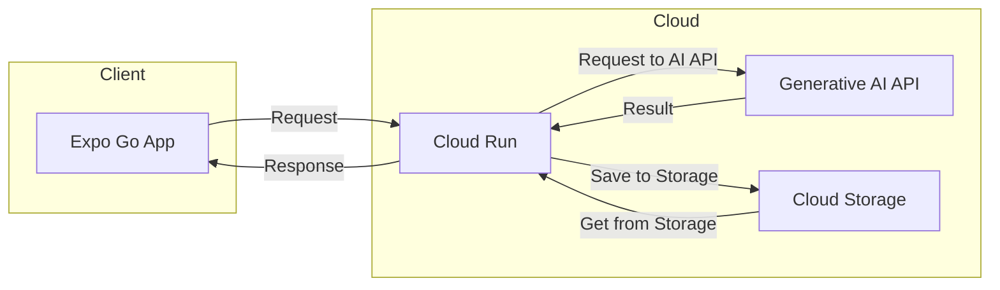
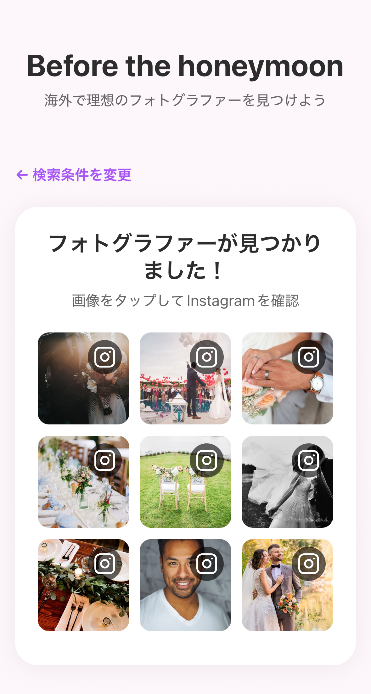

# BeforeTheHoneymoon

## 概要

BeforeTheHoney はハネムーン中の夫婦にぴったりなフォトグラファーを探すサービスです。

## ディレクトリ構成

- backend: FastAPI と Google ADK
- frontend: Expo Go
- infra: Pulumi
- images: 画像リソース

## 全体アーキテクチャ

## イメージ図

  

  

